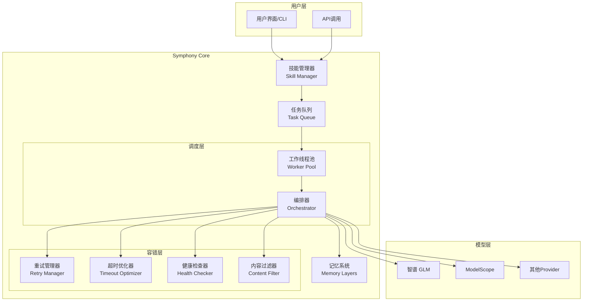
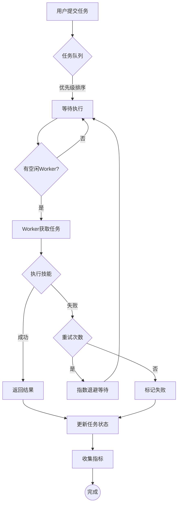
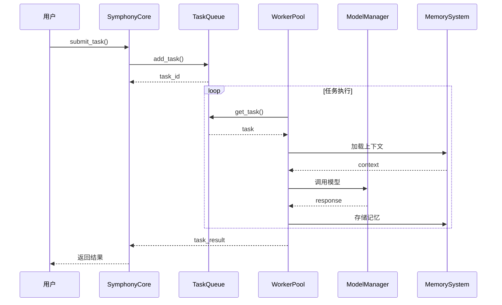

# 🎼 交响 (Symphony) 独立运行完整指南

> **智韵交响，共创华章**
>
> 一个完整的多模型协作调度平台，支持头脑风暴、辩论、评估等多人协作模式

---

## 📋 目录

1. [环境要求](#1-环境要求)
2. [安装步骤](#2-安装步骤)
3. [配置API Key](#3-配置api-key)
4. [运行命令](#4-运行命令)
5. [架构图](#5-架构图)
6. [常见问题](#6-常见问题)

---

## 1. 环境要求

### 1.1 系统要求

| 项目 | 要求 | 说明 |
|------|------|------|
| 操作系统 | Windows 10+ / macOS / Linux | 支持跨平台 |
| Python 版本 | **Python 3.7+** | 推荐 3.8+ |
| 内存 | 最低 4GB | 推荐 8GB+ |
| 磁盘空间 | 至少 500MB | 用于依赖和数据 |

### 1.2 依赖要求

```
requests>=2.25.0
```

项目已包含大部分依赖，仅需基础 Python 环境。

### 1.3 网络要求

- **必须**: 可访问智谱API (https://open.bigmodel.cn)
- **必须**: 可访问 ModelScope API (https://api-inference.modelscope.cn)
- **可选**: 代理设置（如需要访问海外API）

---

## 2. 安装步骤

### 2.1 方式一：直接使用（推荐）

项目已集成到 OpenClaw 工作空间：

```
C:\Users\Administrator\.openclaw\workspace\skills\symphony
```

### 2.2 方式二：独立安装

#### 步骤1：克隆项目

```bash
# 克隆 GitHub 仓库
git clone https://github.com/songleiwww/symphony.git

# 进入项目目录
cd symphony
```

#### 步骤2：创建虚拟环境（可选但推荐）

```bash
# Windows
python -m venv venv
venv\Scripts\activate

# macOS / Linux
python3 -m venv venv
source venv/bin/activate
```

#### 步骤3：安装依赖

```bash
pip install -r requirements.txt
```

或仅安装核心依赖：

```bash
pip install requests
```

#### 步骤4：验证安装

```bash
# 检查 Python 版本
python --version

# 验证 requests 可用
python -c "import requests; print('OK')"
```

---

## 3. 配置 API Key

### 3.1 配置文件位置

编辑 `config.py` 文件：

```
symphony/config.py
```

### 3.2 模型配置模板

```python
# 智谱 GLM 模型配置
{
    "name": "zhipu_glm4_flash",
    "provider": "zhipu",
    "model_id": "glm-4-flash",
    "alias": "智谱GLM-4-Flash",
    "base_url": "https://open.bigmodel.cn/api/paas/v4",
    "api_key": "YOUR_API_KEY_HERE",  # 👈 在这里填入你的API Key
    "api_type": "openai-completions",
    "context_window": 128000,
    "timeout": 60,
    "max_retries": 3,
    "enabled": True,
    "priority": 1
}
```

### 3.3 获取 API Key

#### 智谱 API Key

1. 访问 [智谱开放平台](https://open.bigmodel.cn/)
2. 注册/登录账号
3. 进入「API Keys」页面
4. 创建新的 API Key
5. 复制并填入配置

#### ModelScope API Key

1. 访问 [ModelScope](https://modelscope.cn/)
2. 注册/登录账号
3. 进入「设置」→「API Keys」
4. 创建新的 API Key
5. 复制并填入配置

### 3.4 安全提醒

> ⚠️ **重要**
>
> - **永远不要** 把真实的 Key 上传到 GitHub
> - **保持** config.py 中的 Key 为占位符 `YOUR_API_KEY_HERE`
> - **只在** 本地使用时填入真实 Key
> - **发布前** 务必检查所有配置文件

### 3.5 使用环境变量（更安全）

```python
import os

# 从环境变量读取 API Key
api_key = os.environ.get("ZHIPU_API_KEY", "YOUR_API_KEY_HERE")

config = {
    "api_key": api_key,
    # ...
}
```

设置环境变量：

```bash
# Windows
set ZHIPU_API_KEY=your_real_api_key

# macOS / Linux
export ZHIPU_API_KEY=your_real_api_key
```

---

## 4. 运行命令

### 4.1 快速开始

#### 基本调用示例

```python
# 导入核心模块
from symphony_core import create_symphony

# 创建 Symphony 实例
symphony = create_symphony(register_builtins=True)

try:
    # 启动调度器
    symphony.start(num_workers=4)

    # 提交任务
    task_id = symphony.submit_task(
        name="问候任务",
        skill_name="greet",
        parameters={"name": "Symphony"}
    )

    # 等待任务完成
    import time
    time.sleep(1)

    # 检查结果
    task = symphony.task_queue.get_task_status(task_id)
    print(f"结果: {task.result}")

finally:
    # 停止调度器
    symphony.stop()
```

### 4.2 运行示例脚本

```bash
# 运行完整演示
python symphony_example.py

# 运行核心示例
python symphony_core.py

# 运行头脑风暴
python brainstorm_panel.py "AI未来发展趋势" --mode brainstorm --num 3

# 运行辩论
python brainstorm_panel.py "AI是否会取代人类工作" --mode debate --num 3
```

### 4.3 常用命令行

| 命令 | 说明 |
|------|------|
| `python main.py --help` | 查看帮助 |
| `python main.py add "任务" --priority high` | 添加任务 |
| `python main.py list` | 列出任务 |
| `python main.py stats` | 查看统计 |

### 4.4 在 OpenClaw 中使用

直接在对话中触发：

```
交响讨论：如何提升产品用户体验
```

支持的触发关键字：

| 优先级 | 关键字 | 示例 |
|--------|--------|------|
| P0 | `交响`, `symphony` | "使用交响"、"启动symphony" |
| P1 | `讨论`, `开会`, `协作` | "模型讨论"、"让模型开会" |
| P1 | `专家会诊`, `头脑风暴` | "专家会诊"、"头脑风暴" |

### 4.5 运行测试

```bash
# 运行单元测试
pytest tests/ -v

# 运行自测脚本
python test_symphony.py

# 运行健康检查
python health_checker.py
```

---

## 5. 架构图

### 5.1 系统整体架构



### 5.2 任务调度流程



### 5.3 核心模块说明

| 模块 | 文件 | 说明 |
|------|------|------|
| 技能管理器 | `skill_manager.py` | 内置/自定义/MCP技能管理 |
| 任务队列 | `priority_queue_system.py` | 优先级队列、依赖管理 |
| 记忆系统 | `memory_layers.py` | 短期/长期记忆、分层存储 |
| 重试管理器 | `retry_manager.py` | 指数退避、自动重试 |
| 超时优化器 | `timeout_optimizer.py` | 动态超时调整 |
| 健康检查器 | `health_checker.py` | 模型状态监控 |
| 内容过滤器 | `content_filter.py` | 内容安全过滤 |

### 5.4 数据流



---

## 6. 常见问题

### Q1: Symphony 和现有的 model_manager 有什么关系？

**A**: Symphony 可以独立使用，也可以整合现有的 model_manager 和 fault_tolerance 模块。如果这些模块可用，Symphony 会自动加载它们。

---

### Q2: 如何处理长时间运行的任务？

**A**: 可以：
1. 增加任务的超时设置 (`timeout` 参数)
2. 使用后台任务模式
3. 通过 `task.status` 定期检查进度

```python
# 增加超时
symphony.submit_task(
    name="长时间任务",
    skill_name="process",
    parameters={...},
    timeout=300  # 5分钟
)
```

---

### Q3: 支持分布式部署吗？

**A**: 当前版本是单机版本。分布式支持在计划中。

---

### Q4: 如何添加自定义的任务处理器？

**A**: 可以注册自定义技能：

```python
from symphony_core import Skill, SkillType

def my_handler(param1: str, param2: int = 0) -> dict:
    return {"result": f"处理了 {param1}", "value": param2 * 2}

skill = Skill(
    name="my_skill",
    skill_type=SkillType.CUSTOM,
    description="我的自定义技能",
    version="1.0.0",
    handler=my_handler,
    parameters_schema={...}
)

symphony.skill_manager.register_skill(skill)
```

---

### Q5: API 调用失败怎么办？

**A**: Symphony 内置容错机制：

1. **自动重试**: 默认 3 次重试，指数退避
2. **模型降级**: 自动切换到备选模型
3. **超时优化**: 动态调整超时时间

```python
# 配置重试
symphony.submit_task(
    name="任务",
    max_retries=5,  # 最多重试5次
    ...
)
```

---

### Q6: 如何查看系统状态和指标？

**A**:

```python
# 获取系统状态
status = symphony.get_status()
print(f"总任务: {status['tasks']['total']}")
print(f"已完成: {status['tasks']['completed']}")

# 获取指标
metrics = symphony.get_metrics()
print(f"技能调用: {metrics['skill_calls']}")
print(f"平均耗时: {metrics['avg_task_duration']:.2f}s")
```

---

### Q7: MCP 工具如何使用？

**A**:

```python
# 注册 MCP 服务器
symphony.mcp_manager.register_server(
    "filesystem",
    {
        "command": "npx",
        "args": ["-y", "@modelcontextprotocol/server-filesystem", "/"]
    }
)

# 连接服务器
symphony.mcp_manager.connect_server("filesystem")

# 调用工具
result = symphony.mcp_manager.call_tool(
    "read_file",
    {"path": "/tmp/test.txt"},
    server_name="filesystem"
)
```

---

### Q8: 如何配置多个模型？

**A**: 在 `config.py` 的 `MODEL_CHAIN` 中添加多个模型：

```python
MODEL_CHAIN = [
    {
        "name": "primary_model",
        "provider": "zhipu",
        "model_id": "glm-4-flash",
        "api_key": "YOUR_KEY",
        "priority": 1,
        "enabled": True
    },
    {
        "name": "backup_model",
        "provider": "modelscope",
        "model_id": "deepseek-ai/DeepSeek-R1-0528",
        "api_key": "YOUR_KEY",
        "priority": 2,
        "enabled": True
    }
]
```

---

### Q9: 遇到 "API Key 无效" 错误怎么办？

**A**:

1. 检查 `config.py` 中的 API Key 是否正确
2. 确认 API Key 已在对应平台激活
3. 检查网络是否能访问 API 端点
4. 验证 API Key 是否有足够配额

---

### Q10: 如何获取帮助和支持？

**A**:

- 📖 查看完整文档: [SYMPHONY_README.md](./SYMPHONY_README.md)
- 🐛 报告问题: GitHub Issues
- 💬 社区讨论: GitHub Discussions

---

## 📚 更多资源

| 文档 | 说明 |
|------|------|
| [SYMPHONY_README.md](./SYMPHONY_README.md) | 完整功能说明 |
| [INSTALLATION.md](./INSTALLATION.md) | 安装配置指南 |
| [docs/API.md](./docs/API.md) | API 参考文档 |
| [SKILL.md](./SKILL.md) | 技能说明 |

---

<div align="center">

**智韵交响，共创华章** 🎼

*如有问题，请提交 Issue 或查看文档*

</div>
