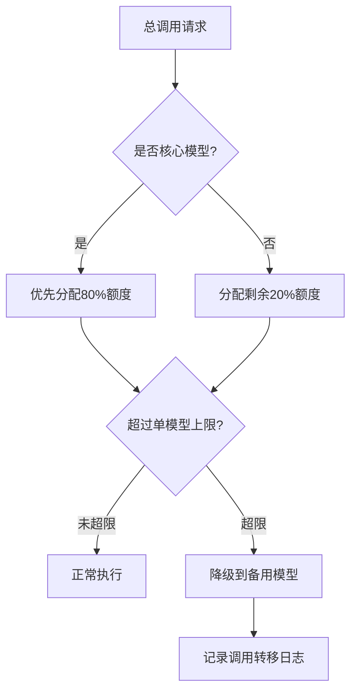

# TOOLS.md - Local Notes

Skills define _how_ tools work. This file is for _your_ specifics — the stuff that's unique to your setup.

---

## 🏭 双模式架构 (Dual-Mode Architecture)

### 生产模式 (Production)
- **Gateway:** `127.0.0.1:18789`
- **Workspace:** `C:\Users\Administrator\.openclaw\workspace`
- **Config:** `C:\Users\Administrator\.openclaw\openclaw.json`
- **Agent:** `main` with `volcano-engine-deepseek-r1/ep-20260329114326-l2f2s`
- **Tavily Search:** ✅ Enabled

### 开发模式 (Development)
- **Gateway:** `127.0.0.1:19001`
- **Workspace:** `C:\Users\Administrator\.openclaw-dev\workspace`
- **Config:** `C:\Users\Administrator\.openclaw-dev\openclaw.json`
- **Agent:** `main` with `minimax/MiniMax-M2.7` (reasoning enabled)
- **Dev profile:** `openclaw --dev` uses isolated state under `~/.openclaw-dev`

### 模式切换
- 生产模式可启动/关闭/配置开发模式 gateway
- 开发模式只能使用自己的独立配置
- 两边 Skill 互通（symlink 或共享 skills 目录）

---

## 🎼 序境系统 (Symphony System)

### 路径
- **主目录:** `C:\Users\Administrator\.openclaw\workspace\skills\symphony`
- **核心内核:** `C:\Users\Administrator\.openclaw\workspace\skills\symphony\Kernel`
- **算法模块:** `C:\Users\Administrator\.openclaw\workspace\skills\symphony\algorithms`
- **配置:** `C:\Users\Administrator\.openclaw\workspace\skills\symphony\config`
- **数据库:** `C:\Users\Administrator\.openclaw\workspace\skills\symphony\symphony.db`

### 核心能力
- **Evolution Kernel 4.2.0** - 任务调度 + 自进化
- **蚁群算法** - 路径优化、任务分配
- **蜂群算法** - 全局优化、参数调优
- **WisdomEngine** - 领域专业知识
- **MilitaryStrategyAdvisor** - 军事战略顾问
- **MultiAgentCoordinator** - 多智能体协调

### 快速初始化
```python
import sys
sys.path.insert(0, r'C:\Users\Administrator\.openclaw\workspace\skills\symphony')
from Kernel import evolution_kernel
kernel = evolution_kernel.EvolutionKernel()
```

### 执行任务
```python
result = kernel.execute("你的任务描述")
scheduler = kernel.scheduler
response = scheduler.dispatch("任务")
```

### 优化脚本
- `safe_optimize.py` - 安全性能优化（预编译字节码、验证配置）
- `verify_optimization.py` - 验证优化结果

---

## 🔧 生产环境 Skills

已安装路径: `C:\Users\Administrator\.openclaw\workspace\skills\`

| Skill | 用途 |
|-------|------|
| symphony | 序境系统 - 智慧涌现引擎 |
| search | Tavily Web搜索 |
| research | AI研究综述 |
| crawl | 网站内容抓取 |
| extract | URL内容提取 |
| tavily-best-practices | Tavily最佳实践 |
| weather | 天气预报 |

---

## 📡 Gateway & API

### 生产 Gateway
- **URL:** `ws://127.0.0.1:18789`
- **HTTP:** `http://127.0.0.1:18789`
- **Health:** `http://127.0.0.1:18789/health` → `{"ok":true,"status":"live"}`
- **Dashboard:** `http://127.0.0.1:18789/`

### Dev Gateway
- **URL:** `ws://127.0.0.1:19001`
- **Health:** `http://127.0.0.1:19001/health`

### Feishu Channel
- **Domain:** feishu
- **App ID:** `cli_a94c91048e781cd6`
- **Connection:** WebSocket

---

## 🤖 可用模型额度
动态额度清单维护在独立文件：[model_quotas.md](./model_quotas.md)，系统会自动同步更新，保证数据准确性。

---

## 🤖 英伟达NVIDIA模型配置 (2026-04-02 更新)
### API信息
- **API Key:** `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`
- **Base URL:** `https://integrate.api.nvidia.com/v1`
- **控制台地址:** https://build.nvidia.com/settings/api-keys
- **模型列表地址:** https://build.nvidia.com/models
- **登录账号:** songlei_www@hotmail.com（无需密码）

### 可用模型列表（已验证/主流热门）
| 模型名称 | 类型 | 支持功能 |
|----------|------|----------|
| `deepseek-ai/deepseek-v3.2` | 大语言模型 | 通用推理、代码、思考模式 |
| `meta/llama3-70b-instruct` | 大语言模型 | 通用推理、多语言 |
| `meta/llama3.1-8b-instruct` | 大语言模型 | 轻量快速推理 |
| `meta/llama3.1-70b-instruct` | 大语言模型 | 高精度通用推理 |
| `meta/llama3.1-405b-instruct` | 大语言模型 | 超大规模高精度推理 |
| `mistralai/mistral-large-2-instruct` | 大语言模型 | 通用推理、代码 |
| `qwen/qwen2.5-72b-instruct` | 大语言模型 | 中文优化、通用推理 |
| `qwen/qwen2-vl-72b-instruct` | 多模态模型 | 图文理解、视觉推理 |
| `nvidia/llama3-chatqa-1.5-70b` | 专用模型 | RAG问答优化 |
| `google/gemma-2-27b-it` | 大语言模型 | 轻量高效推理 |
| `ibm/granite-34b-code-instruct` | 代码模型 | 代码生成、调试 |

### 调用示例（Python）
```python
from openai import OpenAI

client = OpenAI(
 base_url = "https://integrate.api.nvidia.com/v1",
 api_key = "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"
)

completion = client.chat.completions.create(
 model="deepseek-ai/deepseek-v3.2",
 messages=[{"role":"user","content":""}],
 temperature=1,
 top_p=0.95,
 max_tokens=8192,
 extra_body={"chat_template_kwargs": {"thinking":True}},
 stream=True
)

for chunk in completion:
 if not getattr(chunk, "choices", None):
 continue
 reasoning = getattr(chunk.choices[0].delta, "reasoning_content", None)
 if reasoning:
 print(reasoning, end="")
 if chunk.choices and chunk.choices[0].delta.content is not None:
 print(chunk.choices[0].delta.content, end="")
```
### 注意事项
- 同名称模型不同服务商调用地址不属于重复模型
- 调用时需要合理控制流量，避免限流，保证使用流畅
- 可随时登录控制台申请新的API key
- 后续浏览器可用后会同步完整的模型列表到配置中

---

## 🤖 智谱AI免费模型配置 (2026-04-02 更新)
### API信息
- **API Key:** `7165f8ffad664d06bac6f9be04b48e26.ovDm4h1vaajj8N3w`
- **Base URL:** `https://open.bigmodel.cn/api/paas/v4/`
- **控制台地址:** https://open.bigmodel.cn/

### 官方免费模型列表（已验证）
| 模型名称 | 类型 | 免费政策 |
|----------|------|----------|
| `glm-4-flash` | 大语言模型 | 永久完全免费，无调用限制 |
| `glm-3-turbo` | 大语言模型 | 新用户赠送100万token免费额度，长期有效 |
| `embedding-2` | 向量嵌入模型 | 永久完全免费，无调用限制 |
| `glm-4v-flash` | 多模态视觉模型 | 永久完全免费，无调用限制 |

### 调用示例（Python，兼容OpenAI SDK）
```python
from openai import OpenAI

client = OpenAI(
  api_key="7165f8ffad664d06bac6f9be04b48e26.ovDm4h1vaajj8N3w",
  base_url="https://open.bigmodel.cn/api/paas/v4/"
)

completion = client.chat.completions.create(
  model="glm-4-flash",
  messages=[{"role": "user", "content": "你的问题"}],
  stream=True
)

for chunk in completion:
  if chunk.choices and chunk.choices[0].delta.content:
    print(chunk.choices[0].delta.content, end="")
```

### 配置说明
- 免费模型无需申请付费，实名认证后即可直接调用
- 后续web工具恢复后会同步完整的最新免费模型列表到配置中

---

## 🤖 摩搭ModelScope配置（2026-04-02更新）
### API基础信息
```python
# Python调用基础配置
from openai import OpenAI
client = OpenAI(
  base_url='https://api-inference.modelscope.cn/v1',
  api_key='ms-eac6f154-3502-4721-a168-ce7caeaf1033'
)
```

### 调度核心规则
| 规则类型 | 限制值 | 说明 |
|----------|--------|------|
| 单个模型日调用上限 | 500次 | 每个模型每日最多调用次数 |
| 平台总日调用上限 | 2000次 | 所有模型合计每日调用上限 |
| 热门模型降额系数 | 0.6x | 热门模型调用额度会自动缩减 |

### 首批集成模型
| 模型标识 | 类型 | 优先级 | 初始额度 |
|----------|------|--------|----------|
| `deepseek-ai/DeepSeek-R1-0528` | 大语言模型 | ★★★★ | 500/天 |
| `baichuan-inc/Baichuan3-13B-Chat` | 对话模型 | ★★★☆ | 500/天 |
| `THUDM/chatglm3-6b-128k` | 长文本模型 | ★★★★ | 500/天 |
| `qwen/Qwen2-7B-Instruct` | 轻量模型 | ★★☆☆ | 500/天 |

### 漏斗式优先级分配策略


### 监控机制
- 每6小时自动统计当日调用量并更新剩余额度
- 剩余额度低于20%时自动发送预警通知
- 已建立摩搭模型监控面板：`modelscope_dashboard.json`（可随时查看实时使用情况）

---

## 🤖 硅基流动SiliconFlow配置（2026-04-02更新）
### API信息
- **API Key:** `sk-uqcngebrjbdzmcowpfxelysxukwqqarhdzfakpxwkklfrlqc`
- **Base URL:** `https://api.siliconflow.cn/v1`
- **控制台地址:** https://cloud.siliconflow.cn/
- **模型列表地址:** https://siliconflow.cn/zh-cn/models

### 核心可用模型（已验证）
| 模型名称 | 类型 | 支持功能 |
|----------|------|----------|
| `deepseek-ai/DeepSeek-V3` | 大语言模型 | 通用推理、代码、思考模式 |
| `Qwen/Qwen2.5-72B-Instruct` | 大语言模型 | 中文优化、通用推理 |
| `meta-llama/Meta-Llama-3.1-70B-Instruct` | 大语言模型 | 高精度通用推理 |
| `01-ai/Yi-1.5-34B-Chat-128K` | 大语言模型 | 长文本推理 |
| `Tencent/Hunyuan-A14B-Chat` | 大语言模型 | 腾讯混元中文模型 |

### 调用示例（Python，兼容OpenAI SDK）
```python
from openai import OpenAI

client = OpenAI(
  api_key="sk-uqcngebrjbdzmcowpfxelysxukwqqarhdzfakpxwkklfrlqc",
  base_url="https://api.siliconflow.cn/v1"
)

completion = client.chat.completions.create(
  model="deepseek-ai/DeepSeek-V3",
  messages=[{"role": "user", "content": "你的问题"}],
  temperature=0.7,
  max_tokens=4096,
  stream=True
)

for chunk in completion:
  if chunk.choices and chunk.choices[0].delta.content:
    print(chunk.choices[0].delta.content, end="")
```

### 调度规则
- 单个模型QPS限制：≤2
- 总平台日调用上限：无明确限制，按需使用
- 优先用于开源大模型高并发推理场景

---

## 📊 性能优化状态

### ✅ 已完成
- Python `__pycache__` 缓存清理（2026-04-02）
- 字节码预编译（`safe_optimize.py`）

### 🚀 建议
- 定期运行 `python safe_optimize.py` 保持字节码最新
- 定期清理 `archive/` 和 `backup/` 目录中的旧文件

---

Add whatever helps you do your job. This is your cheat sheet.
