# 通义实验室

> 原文链接: https://tongyi.aliyun.com/

---

通义实验室

通义实验室

千问 · 万相

全球领先的AI大模型

千问大语言模型通过超万亿参数规模预训练具备自然语言理解、文本生成、视觉理解、音频理解、工具使用、角色扮演、AI Agent互动等多种能力。

[了解更多](./landing?family=qwen)

Qwen3-Max

全能、至强

Qwen-Plus

旗舰、均衡

Qwen-Flash

轻量、极速

Qwen3-Coder-Plus

代码、Agent

Qwen3-VL-Plus

视觉、感知

Qwen3-Omni-Flash

全模态、多感

Qwen-Image

绘图、精准

[

__

Qwen3-VL-Flash上架百炼

](/news?id=pxwhvf/suodqg/lg29wnzv8vmi2h1o&eId=pxwhvf/suodqg/rtgo7st53v06y1gh)

万相视觉生成大模型通过原生多模态统一框架进行训练，具备图像、视频、声音等多模态生成能力。在画面质量、语义理解、运动幅度、物理规律遵循、艺术质感能力上均达到领先水平。

[了解更多](./landing?family=wan)

Wan2.6-R2V

视频角色参考生成

Wan2.6-I2V

智能多镜头叙事

Wan2.6-T2V

自然音画同步

Wan2.6-T2I

强大的指令遵循能力

Wan2.6-Image

图文混排输出

Wan2.2-Animate

视频换人&图生动作

[

__

Wan2.6系列模型正式发布

](/news?id=pxwhvf/suodqg/qkhh70wdrlgwogs2&eId=pxwhvf/suodqg/zb8ufi86steu3s9v)

数万个客户

选择了千问大模型

适用于

千行百业

数万个客户选择了

千问大模型

适用于千行百业

Qwen-OmniQwen3Qwen-TTSCosyVoiceFun-ASR

#### 消费电子终端

基于千问大模型与多模态交互套件,赋予玩具、穿戴设备、陪伴机器人、智能家居等终端设备全新多模态交互体验。

#### 陪伴与社交

面向社交拟人交互场景，集成千问大模型的实时交互、文字翻译、物体识别等能力，支持虚拟IP打造与实时情感化对话等个性化需求，构建沉浸式交互新体验。

#### 智能座舱

依托千问大模型集成出行助手、智能规划、智能推荐、长期记忆等能力，开创安全愉悦的智能出行新境界。

Qwen-DocQwen-Long数据挖掘

#### 实体识别和电商信息提取

得益于千问大模型的创新算法与能力，可快速准确提取非结构化文本中的关键信息，在招投标、人力资源、数据服务等领域打造智能信息处理新范式。

#### 长文档归纳总结

源于千问大模型领先的数据挖掘和文字分析能力，实现长文档快速解析与精准归纳总结，广泛应用于会议纪要、论文核心解读等场景。

#### 文本分析打标

通过对文本数据的深度分析和自动标注，显著提升文本数据处理效率，广泛支持文本分类、商品标签提取、评论分类及业务数据标注等场景。

Tongyi-intent-detectQwen-Vl-CIPTongyi-fraud-detection

#### 内容安全审核

结合千问大模型，实时分析多模态数据，精准识别欺诈、涉黄及敏感内容，高效过滤风险，保障平台安全与用户体验。

#### 设备风控

打造设备风控领域模型，精准识别黑灰产最新攻击工具特征，高效判定风险设备，泛化能力与覆盖范围全面超越现有专家模型。

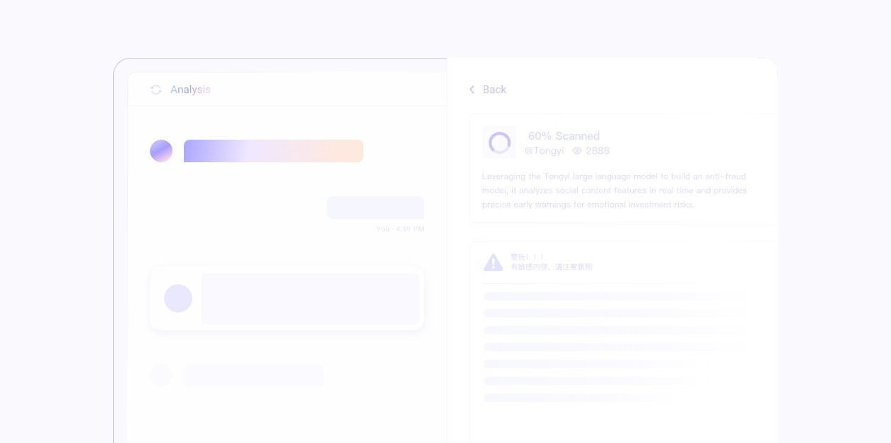

#### 互联网反欺诈

依托千问大模型构建反欺诈模型，实时解析社交内容特征，精准预警情感投资类风险，高效识别身份伪装、诱导行为及违规信息。

千问大模型

深受企业信赖

千问已服务全球超过30万家企业级客户涵盖互联网、消费电子等行业

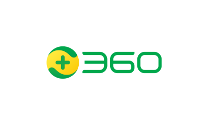

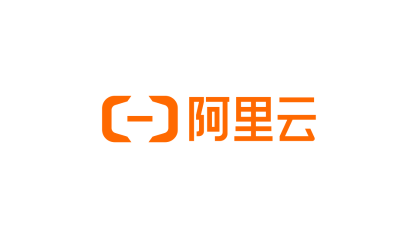

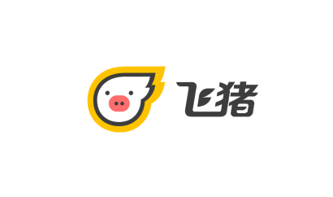

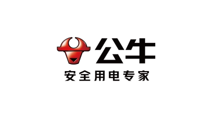

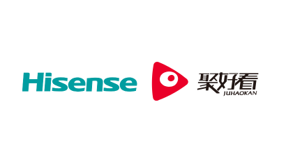

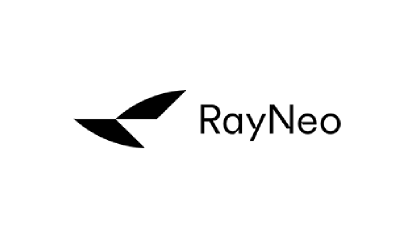

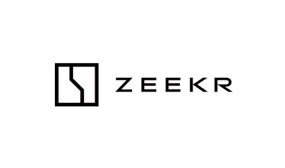

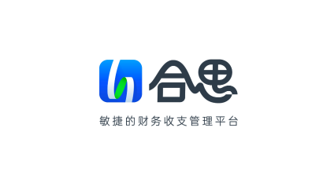

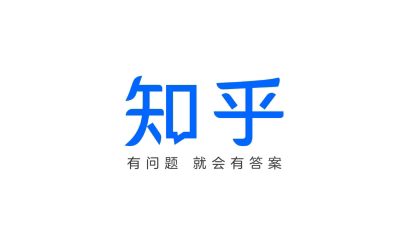

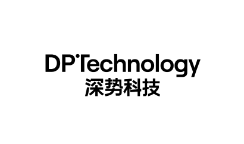

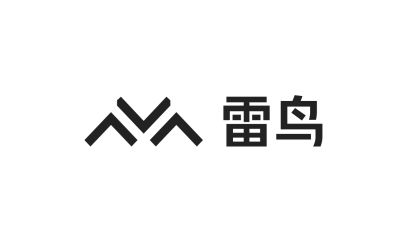

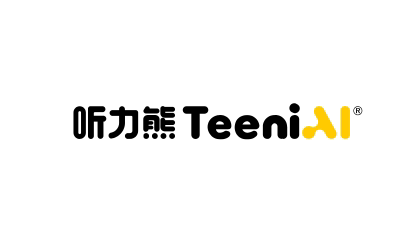

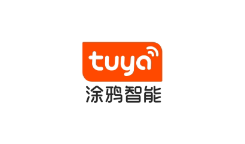

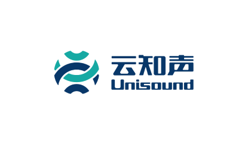

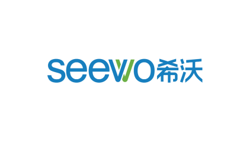

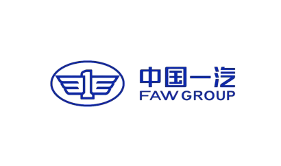

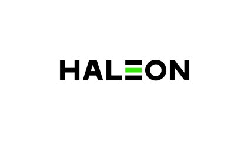

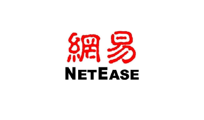

联系我们

__

扫描二维码
了解更多

